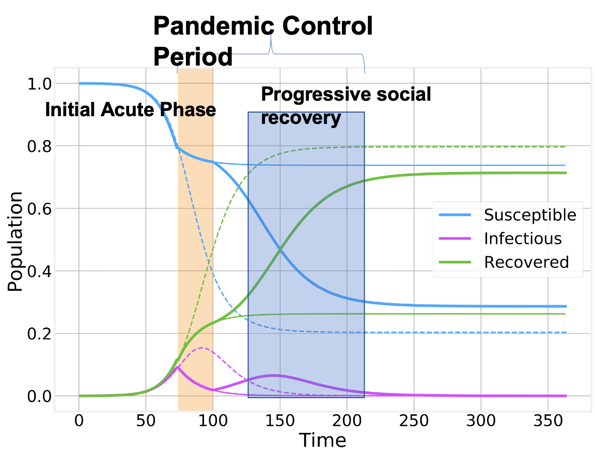
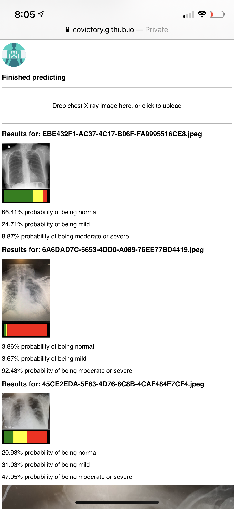
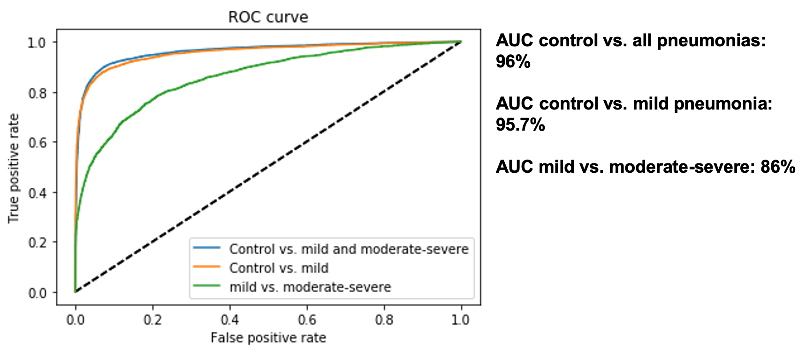

## Slow-down COVID-19

### Goal
Enable pandemic control tool through chest X-ray (CXR) screening to detect early signs of COVID19 using artificila intelligence and mobile apps.

### Background
On March 11, WHO declared COVID19 a pandemic. Since then, public health officials have faced tough decision aimed at controling the pandemic by means of social distancing, confinement and isolation of positives cases. This extreme measurements try to content the infectious curve by reducting the contagious rate so the heatlh care systems can meet the unforseen and striking high demand. 

Early detection and screening is critical to manage the pandemic from a public health perspective. It will be even more important in the second phase of this crisis when public health officials decide to progressively stop the strict confimenent measurements. Pandemic control measurements will be in need.

{:class="img-responsive",:height="400px" width="400px"}

The definitive test for SARS-CoV-2 is the real-time reverse transcriptase-polymerase chain reaction (RT-PCR) test. However, radiographic findings have been reported as a potential tool for screening. The typical radiographic findings that have been reported [are](https://radiopaedia.org/articles/coronavirus-disease-2019-covid-19-1?lang=us):
- ground-glass opacities (GGO) in all hospitalized patients
- crazy paving appearance (GGOs and inter-/intra-lobular septal thickening)
- air space consolidation
- bronchovascular thickening in the lesion
- traction bronchiectasis
Those finding can be detected both in CXR and CT. ALthough CT is more specific, CXR offers a first line of screenign for lung changes related to pneumonia.

The main caractheristics of a pandemic control tool should be 
- High-throughput: ability to do full screening in exposed population even asymptomatic
- Portable: reaching the community without bringing them to major care setting due to avoid nosocomial infections
- Reusable: testing reagents face supplies sortages due to high demand
- Sensitive: detection of early signs (or at least the more acute form of the disease) 

While point of care (PoC) molecular testing can fulfill this need in the longer term, they are still being developed and  approved. CXR can serve as a testing surrogate for early population management to provide a massive screening tool if automatic interpretation is available.

### "Covictory" App
We have devleoped  a free stand-alone client-based web tool for automatic early detection of mild pneumonia from CXR images to help prevent the epidemic.  Beta test version [https://covictory.github.io/site/cxr/]

{:class="img-responsive",:width="250px"}

### How does it work?
We have used three major public X-ray databases to isolate cases with pneumonia. We have further subclassified those cases signs of mild vs. moderate/severe pneumonia to train an artificial intelligence system that can detect early pneumonia as a potential sign of COVID19 infection and health status worsening.  

Our current performace characteristics on an independent testing set

{:class="img-responsive",:width="250px"}

### Support or Contact
This tool has been developed by the team of researchers at the [Applied Chest Imaging Laboratory](acil.med.harvard.edu). 

Code and models are open-source and will be make available shortly for integration in any system. Stay tuned!!!

Contact information: [Raul San Jose Estepar](rsanjose@bwh.harvard.edu)

### Disclamer
This is not meant to be a diagnostic tool. This tool has not been certified by any agency and is not considered a medical device.

### Developing Team
* Raul San Jose Estepar
* Pietro Nardelli
* Steve Pieper
* Gonzalo Vegas Sanchez-Ferrero
* Ruben San Jose Estepar
* James Ross
* Sarah Gerard
* Alejandro Diaz

### Data sharing resources
- https://www.eurorad.org/submit
- https://github.com/ieee8023/covid-chestxray-dataset
- https://www.sirm.org/category/senza-categoria/covid-19/
- https://radiopaedia.org/articles/coronavirus-disease-2019-covid-19-1?lang=us
