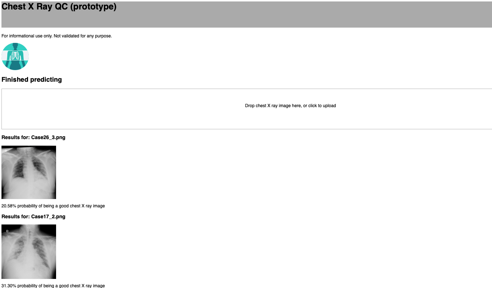

## Slow-down COVID-19

### Goal
Detect potential signs of COVID-19 for epidemiological control using chest X-ray (CXR) as a screening tool.

### Background
The definitive test for SARS-CoV-2 is the real-time reverse transcriptase-polymerase chain reaction (RT-PCR) test. However, radiographic findings have been reported as a potential tool for screening. The typical radiographic findings that have been reported are:
- ground-glass opacities (GGO) in all hospitalized patients
- crazy paving appearance (GGOs and inter-/intra-lobular septal thickening)
- air space consolidation
- bronchovascular thickening in the lesion
- traction bronchiectasis

More information can be found [here](https://radiopaedia.org/articles/coronavirus-disease-2019-covid-19-1?lang=us)

### "Covictory" App
We are developing a free stand-alone client-based web tool for early detection of mild pneumonia from CXR images to help prevent the epidemic. 

The application is under development and the team is making great progress. Here is a beta test version

{:class="img-responsive",:height="250px" width="250px"}

Stay tuned!!. We hope to have a demo site ready in the next few days.

### How does it work?
We have used three major public X-ray databases to isolate cases with pneumonia. We have further subclassified those cases signs of mild vs. moderate/severe pneumonia to train an artificial intelligence system that can detect early pneumonia as a potential sign of COVID-19 infection and health status worsening.  

### Support or Contact
This tool has been developed by the team of researchers at the [Applied Chest Imaging Laboratory](acil.med.harvard.edu). 
Code and models are open-source and will be make available shortly for integration in any system. Stay tuned!!!

Contact information: [Raul San Jose Estepar](rsanjose@bwh.harvard.edu)

### Disclamer
This is not meant to be a diagnostic tool. This tool has not been certified by any agency and is not considered a medical device.

### Data sharing resources
- https://www.eurorad.org/submit
- https://github.com/ieee8023/covid-chestxray-dataset
- https://www.sirm.org/category/senza-categoria/covid-19/
- https://radiopaedia.org/articles/coronavirus-disease-2019-covid-19-1?lang=us
